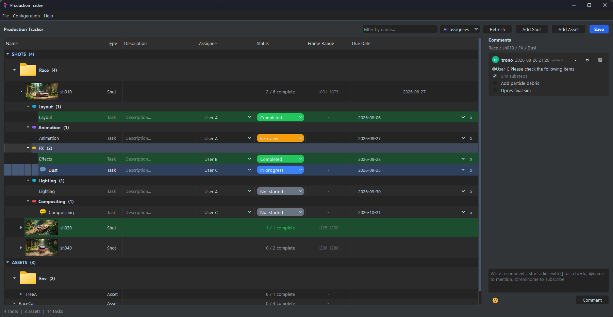
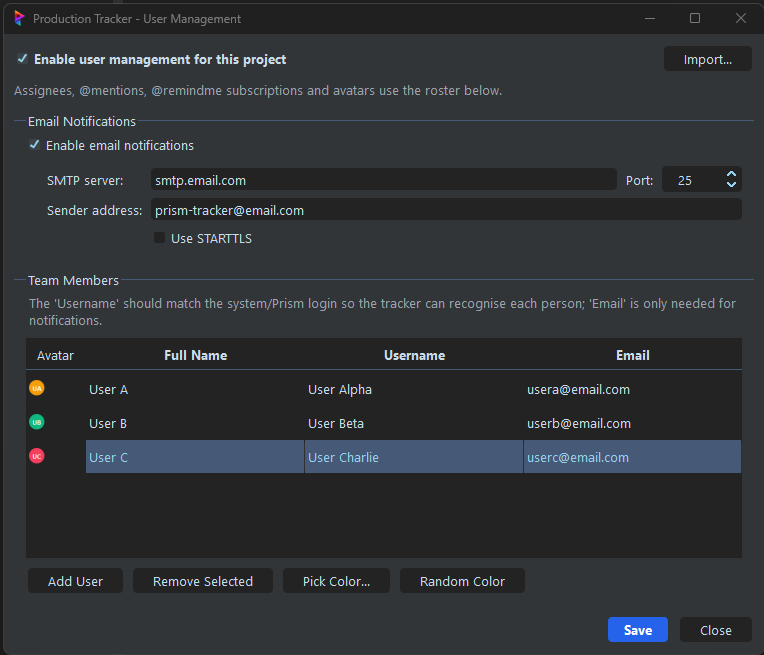
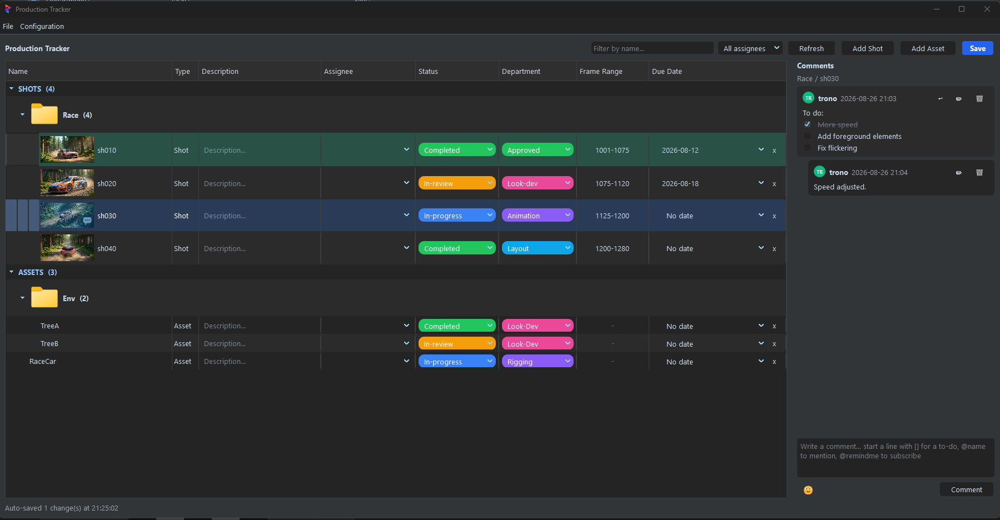

# Production Tracker

[](LICENSE)
[](https://prism-pipeline.com)
[](https://www.buymeacoffee.com/tronotrond)

A production tracking plugin for [Prism Pipeline](https://prism-pipeline.com) 2.x.

It adds a spreadsheet-style overview of every shot and asset in a project —
status, assignee, department, frame range, due date — plus threaded comments
with to-dos, @mentions and reminder subscriptions. Everything is stored in the
project itself, so there is no server to run and no database to maintain.

> **Status:** used in production here, but this is a personal project rather
> than a supported product, and it has only been exercised against the way one
> studio works. Please try it on a copy or a test project before pointing it at
> live work — see [Before you use it in production](#before-you-use-it-in-production).



*Tracking a shot by its Prism departments and tasks: per-task assignees, statuses and due dates, with a threaded comment on the selected task.*

---

## Features

**Tracking**

- **Two modes** (Configuration → Settings): one row per shot, or one row per
  Prism **department and task**, matching the Project Browser's Scenefiles
  tab. See [Tracker modes](#tracker-modes).
- Every shot and asset in one tree, organised the way Prism organises them
  (sequences containing shots, nested folders containing assets).
- Per-entity **status**, **assignee**, **department**, **frame range**,
  **due date** and **description**, each colour-coded.
- **Departments are configurable per project** — add, rename, reorder and
  recolour them (Configuration → Settings). The built-in lists are just the
  defaults.
- Extra **FX layers** can be tracked alongside a shot without creating real
  Prism entities for them.
- Thumbnails from the entity preview, search and assignee filtering, and
  optional row tinting by the assigned person's colour. Thumbnails and row
  tinting each have a toggle under Configuration.
- Add shots and assets from the tracker; they are created in Prism on save.
- **Bulk create**: the Add Shot / Add Asset / Add Task dialogs take as many
  rows as you like. Press **+** to queue another (it inherits the sequence,
  folder or department of the row above, so only the name has to be typed),
  and the trash button drops a row. Duplicates within the batch, and names
  that already exist, are caught before anything is created.
- Right-click anywhere in the tree to add things where you clicked: a section
  or folder offers to create into it (pre-filling the sequence or asset
  folder), a row offers actions on that row.
- Context menu shortcuts to the entity folder, render folder and comp folder.

**Comments**

- Threaded comments per entity, with replies and emoji.
- Markdown-ish `[]` to-do checkboxes that can be ticked off inline.
- `@mentions` and `@remindme` subscriptions — get notified when someone
  replies, when a to-do is completed, or when a status or department changes.
- Unread indicators per entity, tracked per user.

**People and notifications** (optional — see below)

- A team roster stored in the project: full name, login, email, avatar colour.
- Email notifications for mentions, replies and reminders, through any SMTP
  relay.
- A notification log showing every send attempt and its result, so a dead
  relay is visible instead of silent.

**Storage**

Tracker data lives in Prism's own per-entity metadata (`Shotinfo` /
`Assetinfo`), so it travels with the project and is shared by everyone
working on it. Saves re-read the newest data before merging and only write
rows that actually changed, so two people editing at once do not clobber each
other.

---

## Requirements

- Prism Pipeline 2.x (developed against **2.1.3**)
- No third-party Python packages — only Prism's own modules and `qtpy`

---

## Installation

1. Clone or download this repository.
2. In Prism: **Settings → Plugins → add a plugin search path**, and point it at
   the folder that *contains* `ProductionTracker` — that is the repository
   root, not the `ProductionTracker` folder itself.
3. Restart Prism.

A **Production Tracker** menu appears in the Project Browser menu bar with
**Open Tracker** and **User Management**.

---

## User management

User management is **off by default**, and the plugin is fully usable that way.

**Switched off** — comments are posted under your plain Prism username.
Mentions, reminders and notifications are inactive, and `@` is just an
ordinary character in the compose box. The Assignee column, the assignee
filter and per-user row tinting are hidden, since there is nobody to assign
work to. Nothing needs configuring.

Any assignees stored while the feature was on are kept, not discarded, and
reappear if you switch it back on.

**Switched on** — the team roster drives assignee dropdowns, avatars,
`@mentions`, `@remindme` subscriptions and (optionally) email notifications.

To turn it on, open **Production Tracker → User Management** and tick
*Enable user management for this project*. Then add people, giving each one
the **username they log in with**, so the tracker can recognise who is who.



### Email notifications

Inside User Management, tick *Enable email notifications* and fill in the SMTP
server, port and sender address. There is no default relay — notifications
stay inactive until a server is entered. Sending is best-effort and happens on
a background thread: an unreachable relay never interrupts your work, it just
shows up in **Configuration → View Notification Log**.

### Importing people from another project

The roster is per project, so a new project starts empty. Rather than retyping
everyone, press **Import…** and pick *another Prism project folder* — the
plugin finds the tracker data inside it for you. If this project already has
people, you are asked whether to **Merge** (add only people who aren't in the
list yet) or **Replace**. Nothing is written until you press Save.

---

## Tracker modes

The tracker can lay a project out two ways. Pick one under
**Configuration → Settings**.

### One task per shot (default)

Every shot and asset is a single tracked row with its own status, assignee,
department, due date and comments. Best when a shot is one unit of work.



### Use Prism departments and tasks

The tracker groups each shot by its real Prism **departments** and the
**tasks** inside them, the same structure the Project Browser's Scenefiles
tab shows:

```
Studio                        (sequence)
  GenWithStack   Shot   2 / 3 complete   1001-1003
    Lighting                  (department)
      Lighting     Task   In-progress    2026-09-01
    Compositing               (department)
      Compositing  Task   Not started
```

- Each **task** is the tracked row — status, assignee, due date, description
  and its own comment thread.
- The **shot** becomes a summary: how many of its tasks are complete, and the
  earliest outstanding due date. Its own controls are hidden so there is one
  obvious place to set each thing.
- The **Department** column is hidden, since the tree groups by department
  already.
- FX layers are a shot-mode feature and are not offered here.

This is the mode shown in the screenshot at the top of this page.

Departments and tasks only exist once something has been created in them, so
the tracker shows what is really on disk. To add one, right-click a shot or a
department folder and choose **Add Task…** — it creates a real department/task
folder through Prism, so the Project Browser sees it too.

A shot whose tasks are all complete is tinted green, the same way a finished
row is in the other mode.

### Switching modes

The two modes store their data in different places, so switching is lossless
but each mode only shows what was entered in that mode:

| Mode | Tracker fields stored in |
| --- | --- |
| One task per shot | the entity's Prism metadata (`Shotinfo` / `Assetinfo`) |
| Prism departments and tasks | each task's own `info` file, next to the task |

Nothing is deleted when you switch, and per-task data sits alongside whatever
else Prism keeps in that file.

---

## Departments

Departments are purely informational — they are not tied to any Prism
pipeline step — and give leads another read on where a shot or asset actually
is. Shots and assets move through different pipelines, so each has its own
list, and FX layer rows are locked to a single department of their own.

Edit them under **Configuration → Settings**: add, remove, rename, reorder and
recolour. A blank entry is always offered first (meaning "not set"), and
**Approved** is always added as the last entry to mark the end of the
pipeline — you cannot rename, recolour or reorder it, so "finished" stays one
recognisable value across every project. A shot that is both *Completed* and
*Approved* gets the green "fully wrapped up" row tint.

Renaming a department does **not** rewrite shots and assets that already use
the old name. They keep it, and it stays available in their dropdown until you
set them to something else, so editing the list can never quietly change
stored data.

Statuses are deliberately **not** configurable: *Not started, In-progress,
In-review, Completed* and *Not needed* mean the same thing in every project,
which keeps a handed-over project readable.

---

## Where data is stored

| What | Where |
| --- | --- |
| Status, assignee, department, dates, comments (shot mode) | Prism's per-entity metadata (`Shotinfo` / `Assetinfo`) |
| The same fields per task (task mode) | `<task folder>/info.json` |
| Roster, notification settings, departments | `<pipeline>/Configs/ProductionTracker.json` |
| Notification send log | `<pipeline>/Configs/ProductionTracker_NotifyLog.json` |
| "Colour rows by user" preference | Your Prism user config (per user, not per project) |

Every path is resolved by asking Prism, not by assuming folder names, so
projects that have renamed `00_Pipeline`, `Configs` or the render folders work
without changes — including projects you import a roster from.

Nothing is stored outside the project, and there is no global or shared
network location. Copying a project copies its tracker data with it.

---

## What the plugin writes

Worth reading before adding this to an existing project. The tracker keeps
its own settings in its own file, but the per-entity tracking data lives in
Prism's own entity-info files, because that is what makes it travel with the
project and be visible to everyone.

| File | Owner | What the tracker does |
| --- | --- | --- |
| `<pipeline>/Configs/ProductionTracker.json` | the plugin | Its own file: mode, roster, notification settings, departments. |
| `<pipeline>/Configs/ProductionTracker_NotifyLog.json` | the plugin | Its own file: the notification send log. |
| `<pipeline>/Shotinfo/shotInfo.*` | **Prism** | Adds `tracker_*` keys inside each shot's `metadata` block. Frame ranges go through Prism's own `setShotRange`. |
| `<pipeline>/Assetinfo/assetInfo.*` | **Prism** | Adds `tracker_*` keys inside each asset's `metadata` block. Descriptions go through Prism's own `setAssetDescription`. |
| `<task folder>/info.*` | **Prism** | Task-mode only: adds `tracker_*` keys for that task. |
| `Documents/Prism2/Prism.json` | **Prism (per user)** | One namespaced `productiontracker` section: the row-colour preference and which comments you have read. Per user, never per project. |

The project config (`pipeline.json`) is **never** written.

### How the shared files are kept safe

- Every key the tracker adds is prefixed `tracker_`, so it cannot collide with
  Prism's own fields or with metadata anyone adds by hand.
- Prism's `setMetaData` replaces an entity's whole `metadata` block, so the
  tracker always re-reads that block and adds to it. Keys put there by Prism
  or by another tool survive. Prism re-reads the file before writing, so other
  entities are never affected.
- Comment threads **merge** rather than overwrite, so two people commenting on
  the same entity at once do not clobber each other.
- Only rows that actually changed are written.

### Things to know

- **`Description` is Prism's field, not ours.** The tracker's Description
  column reads and writes the same `Description` metadata Prism itself shows
  and searches on. Editing it in the tracker changes it in Prism. This is
  deliberate, but it is the one field that is not namespaced.
- **Task `info` files.** In task mode the tracker stores task fields in
  `<task folder>/info.*`, which is Prism's file. Prism 2.1.3 defines
  `getTaskData`/`setTaskData` for it but never calls them, so in practice the
  tracker is the only writer. Writes merge into whatever is already there, so
  a future Prism version that starts using the file would sit alongside.
- **Deleting an entity from the tracker** removes its entry from Prism's shot
  or asset info file, and removes the (empty) folder. That is a real deletion
  of Prism data, and it asks first.
- **Concurrency.** Saves re-read before merging, but the entity-info files are
  rewritten whole rather than patched in place. Two people saving the *same*
  entity in the same instant is the one case that can lose an edit.

### Known Prism behaviour to be aware of

**Assets are keyed by name, not by path.** Prism stores asset data under the
asset's name (`getAssetNameFromPath` returns the basename), so
`Characters/Dog` and `Props/Dog` share one record — one status, assignee, due
date and comment thread, in Prism as well as here. The tracker detects this
on open and says which assets are affected; renaming them apart is the only
way to track them separately.

**Episodes are supported** — sequences, shots, frame ranges and Add Shot are
all episode aware, and two shots with the same name in different episodes are
kept apart. See the table below for how far that has been proven.

### Before you use it in production

Prism projects differ more than you might expect — episodes, nested asset
folders, renamed pipeline folders, local files, different Prism versions — and
this plugin has grown around one studio's setup. It is offered in the hope it
is useful, but **you use it at your own risk**, and the licence disclaims
warranty in the usual formal terms.

A sensible way in:

1. **Look before you touch.** Nothing is written until you edit a field and
   Save, so opening the tracker on a real project is safe to browse.
2. **Try it on a copy first**, or on a throwaway project — add a shot, set a
   status, write a comment, delete something, and check Prism's own Project
   Browser still shows what you expect.
3. **Keep a backup of two folders.** `Shotinfo` and `Assetinfo` inside the
   pipeline folder hold everything the tracker touches outside its own file
   (plus each task's `info` file in task mode). Copying those is enough to get
   back to where you started.
4. **Roll it out on one project** before making it part of how everyone works.

What has actually been exercised:

| | |
| --- | --- |
| **Tested against** | Prism 2.1.3 on Windows, projects without episodes, nested asset folders, custom department and task names |
| **Written for but not yet proven in a real project** | episode-based projects — the logic is covered by tests against stubbed Prism responses, not by a real episode project |
| **Not verified at all** | other Prism 2.x versions, macOS and Linux, Prism 1 compatibility mode, projects using Prism's local-files feature |

If something breaks, or your project is laid out in a way the tracker gets
wrong, please open an issue with your Prism version and how the project is
organised — that is the most useful thing you can send.

---

## Support the project

This is built and maintained in my own time. If it saves you some, a coffee is
always appreciated:

<a href="https://www.buymeacoffee.com/tronotrond" target="_blank"></a>

---

## Contributing

Bug reports and pull requests are welcome. Please keep the existing style:
Prism's `@err_catcher` decorators on public methods, no new third-party
dependencies, and paths resolved through Prism's API rather than hardcoded.

---

## Licence

Copyright (C) 2026 Trond Hille.

Released under the **GNU General Public License v3.0 or later** — see
[LICENSE](LICENSE). In short: you may use, study, modify and redistribute it,
and if you distribute a modified version it must also be under the GPL, with
the original attribution intact.

**Commercial licensing:** if you want to use this in a proprietary product
without the GPL's obligations, that is available separately — contact the
copyright holder to arrange terms.

Prism Pipeline itself is licensed LGPL-3.0-or-later by Prism Software GmbH and
is not included in this repository.
